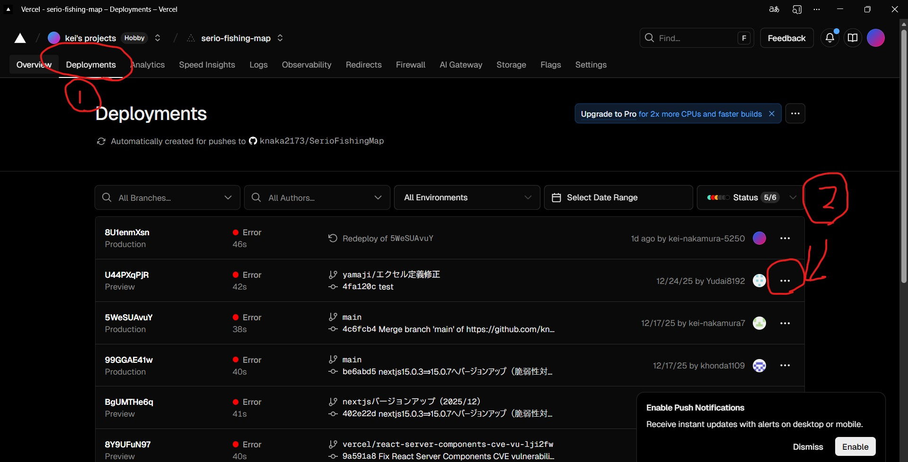
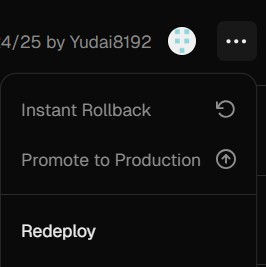
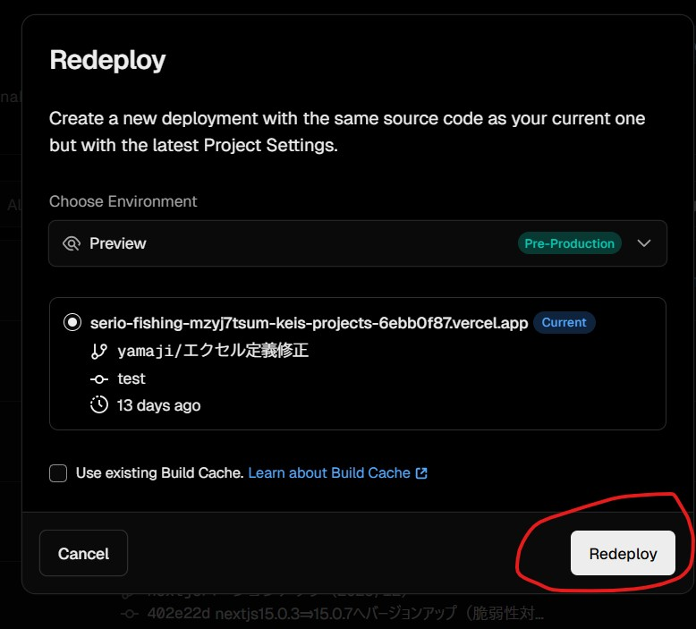

# Vercel Redeploy 実行手順

本資料では、Vercel の管理画面から  
**既存のデプロイを再実行（Redeploy）する手順** を説明します。

---

## 1. Deployments 画面を開く

Vercel の対象プロジェクトを開き、上部メニューから **Deployments** を選択します。

### ポイント

- 過去に実行されたすべてのデプロイ履歴が表示されます
- Production / Preview の区別も確認できます

---

## 2. Redeploy したいデプロイを選択

デプロイ一覧の中から、再実行したいデプロイ行を探します。  
右端にある **「︙（三点リーダー）」** をクリックします。

### 確認できる情報

- Environment（Production / Preview）
- ブランチ名
- コミット ID
- 実行日時
- ステータス（Success / Error）

---

## 3. 「Redeploy」を選択

表示されたメニューから **Redeploy** をクリックします。

> Redeploy は  
> **同じソースコードを使用し、最新の Project Settings で再ビルド・再デプロイ**  
> を行う操作です。

---

## 4. Redeploy 設定を確認する

Redeploy の確認ダイアログが表示されます。

### 確認ポイント

- **Choose Environment**
  - Preview（Pre-Production）
  - Production
- 対象デプロイ
  - ブランチ名
  - コミット
  - 実行日時

### Build Cache について

- **Use existing Build Cache**
  - チェックあり：ビルド高速
  - チェックなし：クリーンビルド（トラブル時に有効）

---

## 5. Redeploy を実行する

内容を確認後、右下の **Redeploy** ボタンをクリックします。

これで再デプロイが開始されます。

---

## 6. 実行結果を確認する

Deployments 画面に戻り、ステータスを確認します。

- 🟢 Success：デプロイ成功
- 🔴 Error：ビルドまたはデプロイ失敗

失敗した場合は、該当デプロイをクリックして **Build Logs** を確認してください。

---

## Redeploy を使う主なケース

- 環境変数（Environment Variables）を変更した
- Project Settings を変更した
- 一時的なビルド失敗を再実行したい
- コード変更なしで再デプロイしたい

---

## 注意点

- Redeploy では **最新の GitHub コミットは取り込まれません**
- 新しいコードを反映する場合は、GitHub に push してください

---

以上で、Vercel の Redeploy 手順の説明は完了です。
